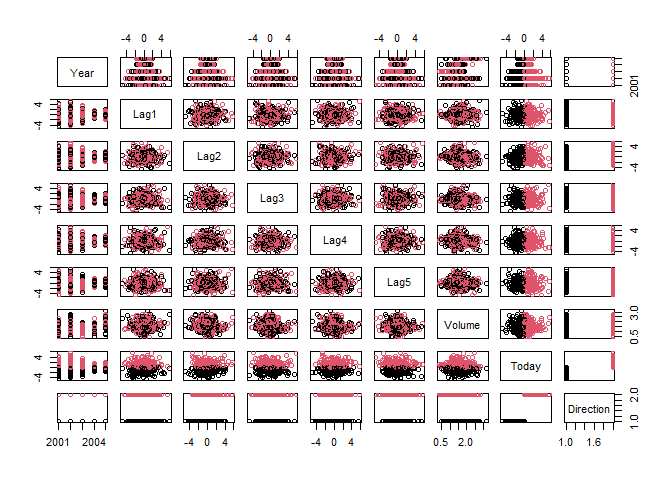

Chapter 4: Classification
================

### Logistics regression

First we attach the dataset by loading the package of ISLR:

``` r
require(ISLR)
```

Next we can have a look at the data of Smarket:

``` r
head(Smarket)
```

    ##   Year   Lag1   Lag2   Lag3   Lag4   Lag5 Volume  Today Direction
    ## 1 2001  0.381 -0.192 -2.624 -1.055  5.010 1.1913  0.959        Up
    ## 2 2001  0.959  0.381 -0.192 -2.624 -1.055 1.2965  1.032        Up
    ## 3 2001  1.032  0.959  0.381 -0.192 -2.624 1.4112 -0.623      Down
    ## 4 2001 -0.623  1.032  0.959  0.381 -0.192 1.2760  0.614        Up
    ## 5 2001  0.614 -0.623  1.032  0.959  0.381 1.2057  0.213        Up
    ## 6 2001  0.213  0.614 -0.623  1.032  0.959 1.3491  1.392        Up

``` r
summary(Smarket)
```

    ##       Year           Lag1                Lag2                Lag3          
    ##  Min.   :2001   Min.   :-4.922000   Min.   :-4.922000   Min.   :-4.922000  
    ##  1st Qu.:2002   1st Qu.:-0.639500   1st Qu.:-0.639500   1st Qu.:-0.640000  
    ##  Median :2003   Median : 0.039000   Median : 0.039000   Median : 0.038500  
    ##  Mean   :2003   Mean   : 0.003834   Mean   : 0.003919   Mean   : 0.001716  
    ##  3rd Qu.:2004   3rd Qu.: 0.596750   3rd Qu.: 0.596750   3rd Qu.: 0.596750  
    ##  Max.   :2005   Max.   : 5.733000   Max.   : 5.733000   Max.   : 5.733000  
    ##       Lag4                Lag5              Volume           Today          
    ##  Min.   :-4.922000   Min.   :-4.92200   Min.   :0.3561   Min.   :-4.922000  
    ##  1st Qu.:-0.640000   1st Qu.:-0.64000   1st Qu.:1.2574   1st Qu.:-0.639500  
    ##  Median : 0.038500   Median : 0.03850   Median :1.4229   Median : 0.038500  
    ##  Mean   : 0.001636   Mean   : 0.00561   Mean   :1.4783   Mean   : 0.003138  
    ##  3rd Qu.: 0.596750   3rd Qu.: 0.59700   3rd Qu.:1.6417   3rd Qu.: 0.596750  
    ##  Max.   : 5.733000   Max.   : 5.73300   Max.   :3.1525   Max.   : 5.733000  
    ##  Direction 
    ##  Down:602  
    ##  Up  :648  
    ##            
    ##            
    ##            
    ## 

``` r
pairs(Smarket, col=Smarket$Direction)
```



Now we start to generate the models:

``` r
glm.fit=glm(Direction~Lag1+Lag2+Lag3+Lag4+Lag5+Volume,
            data=Smarket, family=binomial)
summary(glm.fit)
```

    ## 
    ## Call:
    ## glm(formula = Direction ~ Lag1 + Lag2 + Lag3 + Lag4 + Lag5 + 
    ##     Volume, family = binomial, data = Smarket)
    ## 
    ## Deviance Residuals: 
    ##    Min      1Q  Median      3Q     Max  
    ## -1.446  -1.203   1.065   1.145   1.326  
    ## 
    ## Coefficients:
    ##              Estimate Std. Error z value Pr(>|z|)
    ## (Intercept) -0.126000   0.240736  -0.523    0.601
    ## Lag1        -0.073074   0.050167  -1.457    0.145
    ## Lag2        -0.042301   0.050086  -0.845    0.398
    ## Lag3         0.011085   0.049939   0.222    0.824
    ## Lag4         0.009359   0.049974   0.187    0.851
    ## Lag5         0.010313   0.049511   0.208    0.835
    ## Volume       0.135441   0.158360   0.855    0.392
    ## 
    ## (Dispersion parameter for binomial family taken to be 1)
    ## 
    ##     Null deviance: 1731.2  on 1249  degrees of freedom
    ## Residual deviance: 1727.6  on 1243  degrees of freedom
    ## AIC: 1741.6
    ## 
    ## Number of Fisher Scoring iterations: 3

As you can see, there is no significant variable found.

``` r
glm.probs=predict(glm.fit,type="response")
glm.probs[1:5]
```

    ##         1         2         3         4         5 
    ## 0.5070841 0.4814679 0.4811388 0.5152224 0.5107812

``` r
glm.pred=ifelse(glm.probs>0.5,"Up","Down")
attach(Smarket)
table(glm.pred, Direction)
```

    ##         Direction
    ## glm.pred Down  Up
    ##     Down  145 141
    ##     Up    457 507

``` r
mean(glm.pred==Direction)
```

    ## [1] 0.5216

Now we are trying to make the training and test set

``` r
train=Year<2005
glm.fit=glm(Direction~Lag1+Lag2+Lag3+Lag4+Lag5+Volume,
            data=Smarket, family=binomial, subset = train)
glm.probs=predict(glm.fit,newdata = Smarket[!train,], type="response")
glm.pred=ifelse(glm.probs>0.5,"Up","Down")
Direction.2005=Smarket$Direction[!train]
table(glm.pred,Direction.2005)
```

    ##         Direction.2005
    ## glm.pred Down Up
    ##     Down   77 97
    ##     Up     34 44

``` r
mean(glm.pred==Direction.2005)
```

    ## [1] 0.4801587

And then we are trying to fit a smaller model

``` r
glm.fit=glm(Direction~Lag1+Lag2,
            data=Smarket, family=binomial, subset = train)
glm.probs=predict(glm.fit,newdata = Smarket[!train,], type="response")
glm.pred=ifelse(glm.probs>0.5,"Up","Down")
table(glm.pred,Direction.2005)
```

    ##         Direction.2005
    ## glm.pred Down  Up
    ##     Down   35  35
    ##     Up     76 106

``` r
mean(glm.pred==Direction.2005)
```

    ## [1] 0.5595238

``` r
summary(glm.fit)
```

    ## 
    ## Call:
    ## glm(formula = Direction ~ Lag1 + Lag2, family = binomial, data = Smarket, 
    ##     subset = train)
    ## 
    ## Deviance Residuals: 
    ##    Min      1Q  Median      3Q     Max  
    ## -1.345  -1.188   1.074   1.164   1.326  
    ## 
    ## Coefficients:
    ##             Estimate Std. Error z value Pr(>|z|)
    ## (Intercept)  0.03222    0.06338   0.508    0.611
    ## Lag1        -0.05562    0.05171  -1.076    0.282
    ## Lag2        -0.04449    0.05166  -0.861    0.389
    ## 
    ## (Dispersion parameter for binomial family taken to be 1)
    ## 
    ##     Null deviance: 1383.3  on 997  degrees of freedom
    ## Residual deviance: 1381.4  on 995  degrees of freedom
    ## AIC: 1387.4
    ## 
    ## Number of Fisher Scoring iterations: 3
